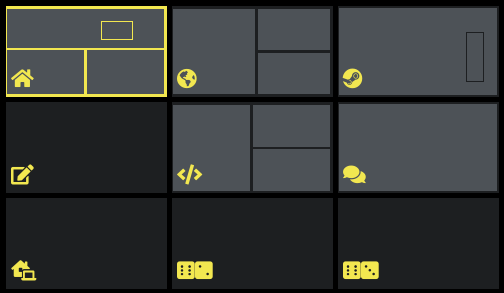

# XDPager

The X(org)D(esktop)Pager is an attempt at writing a pager similar to the workspace switcher of XFCE, without all the extra Desktop Environment (DE) dependencies. This is useful for those that prefer a non-DE setup like xmonad, i3, etc. but would still like an Exposé-lite feature.  XDPager assumes an EWMH compliant window manager. 

## Features
- Shows a dynamic view of workspaces and windows on each when loaded
- Switches workspaces via XK_Return or mouse click
- Search for and activate windows by their className
- Draws UTF8 strings via Xft (e.g. for icon fonts)

## Installation
- Clone the repository
- Run `make`
- Execute `xdpager` or hook it up to a keybinding

## Dependencies
- libX11 (likely installed)
- libXft and freetype2 (likely installed)
- xdotool (commands to the window manager)

## Configuration
Config file loading is TBD; options are currently hardcoded in `main.c`.  This means XDPager will need to be rebuilt in order to show changes.

### navType
Changes the behavior of moving the workspace selection.

| navType | Description |
| ------- | ----------- |
| `NAV_NORMAL_SELECTION` | Workspace won't change until XK_Return is pressed or mouse click. |
| `NAV_MOVE_WITH_SELECTION` | Workspace will change when the selection changes. Typically used if xdpager is set as a sticky window. Consult your WM for limitations on sticky windows. |
| `NAV_MOVE_WITH_SELECTION_EXPERIMENTAL` | Workspace will change with the selection _and_ xdpager will move to that workspace. Visually distracting depending on compositor effects, time to unmap/map/redraw, etc. Not recommended for now. |
 
>  TODO: add videos demonstrating these differences

### nWorkspaces
The number of workspaces to render.  XDPager will only display workspaces [0, nWorkspaces].  This will be irrelvant if dynamic workspaces are ever implemented.

### workspacesPerRow
The number of workspaces to show per row in the grid.  If workspacesPerRow == nWorkspaces, XDPager renders a single row.  If workspacesPerRow == 1, XDPager renders a single column.

## searchPrefix
The string prefix to indicates XDPager is in search mode.  This string supports UTF8.

## colors
Everything is hardcoded.  Knock yourself out.

## Project Details
The following sections contain details you probably don't care about
### Limitations
- Filtering limited to alphanumeric characters until I figure out how unicode keylogging works.
- Number of desktops is statically defined.  Max number of windows is statically defined.  Dynamic desktop support should be possible with an extension watching the `_NET_NUM_DESKTOPS` atom on the root window.
### The problem with `_NET_CLIENT_LIST_STACKING`
 While XDPager relies on an EWMH compliant window manager, certain window managers (e.g. xmonad) don't fully comply with features they claim to support.  Ideally, XDPager could simply watch `_NET_CLIENT_LIST_STACKING` to determine which windows matter and which are above others.  However, when a window manager doesn't maintain correct stacking order in this list, there is no way to tell which windows should be drawn first without asking for the children of the root window.  Since the list of children has to be traversed anyway, XDPager just sources data from that.

## FAQ
> Why doesn't XDPager have live window content previews?  Gnome/Cinnamon/whoever has a real fullscreen exposé feature!

XDPager is written with tiling window managers in mind (xmonad, i3, etc.) which treat non-visible windows differently than ``<your favorite DE>``. Typically, a window manager will unmap windows that aren't visible.  The window managers of popular DEs cheat this by leaving offscreen window mapped.  This project is not attempting to solve this limitation of the intended audience.

## Disclaimer
- This is my first C program so I don't know what I'm doing
- The UTF8 decoding was copied from another repository (TODO: find that link...)